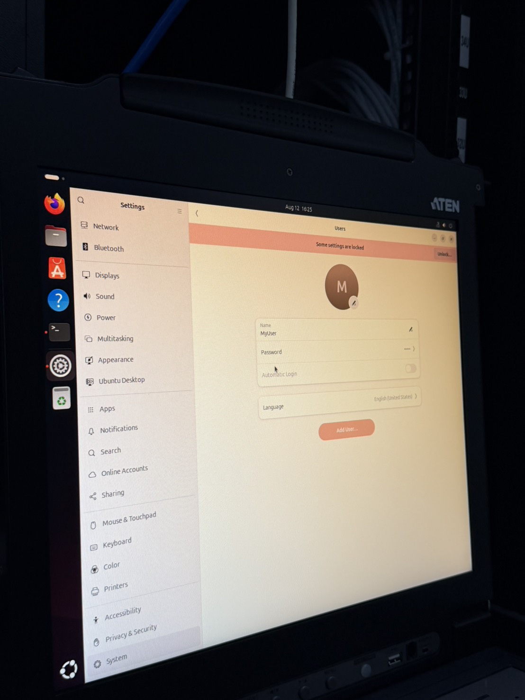
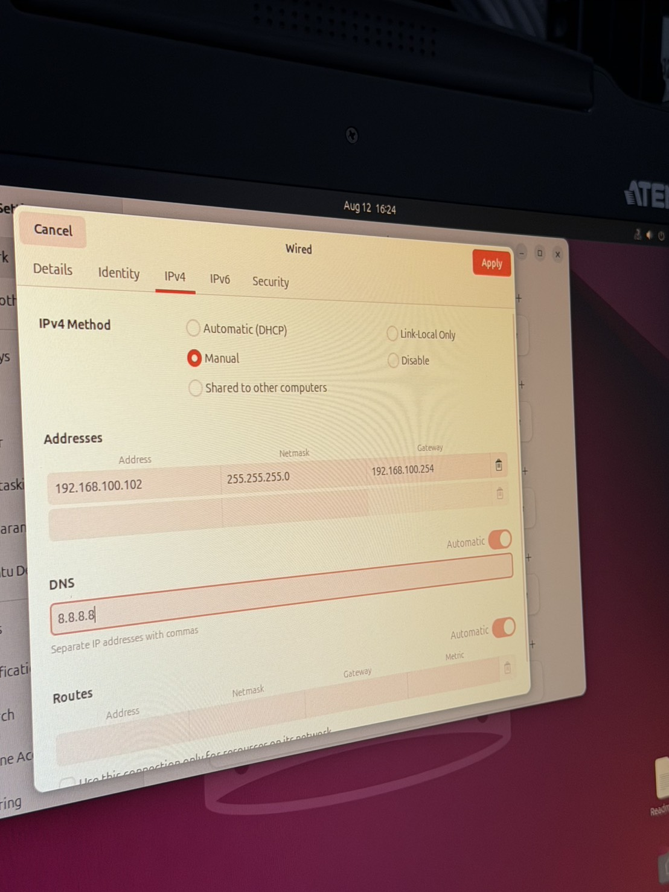

# 2026/08/12 工作紀錄

## 一、今日摘要

- 完成案場 Ubuntu 基本設定，包含帳號密碼與固定 IP。
- 整理前後端、Reverse Proxy、WebSocket 的 Docker 部署方式。
- 完成主要容器啟動確認，並記錄網路與 Proxy 的除錯方式。
- 使用 Stella 提供的部署工具處理前後端部署。

## 二、案場必要設定

| 項目 | 設定／操作 |
|---|---|
| Ubuntu 密碼 | `Settings → Users` 設定使用者密碼 |
| IP 模式 | `Wired → IPv4 → Manual` |
| IP Address | `192.168.100.102` |
| Netmask | `255.255.255.0` |
| Gateway | `192.168.100.254` |
| DNS | `8.8.8.8` |
| 網路確認 | 先確認乙太網路固定 IP，再透過 `192.168.100.254` 檢查／設定現場網路 |

<figure style="border: 1px solid #999; padding: 12px; border-radius: 8px;display: inline-block; text-align: center; background-color: #f9f9f9;">
  
  <figcaption>ubuntu setting password</figcaption>
</figure>

<figure style="border: 1px solid #999; padding: 12px; border-radius: 8px;display: inline-block; text-align: center; background-color: #f9f9f9;">
  
  <figcaption>ubuntu setting wired</figcaption>
</figure>

## 三、前後端部署與網路

### Docker Images

- 案場若沒有外網，需事先準備前後端 Docker images，帶到地端後匯入使用。

### Docker Compose 網路

- 服務放在同一份 Docker Compose 時，Compose 會自動建立共用網路，服務可用 service name 互相連線。
- 服務拆成不同 Compose 時，需建立共用的 external network，例如 `femc_*_network`，並讓各服務加入該網路。
- Reverse Proxy 是對外入口，外部請求會先進入 Proxy，再轉送到前端或後端服務。

## 四、部署與除錯紀錄

- 檢查 `/etc/haproxy/haproxy.cfg`：確認監聽位置、frontend、backend 與必要設定均已加入。
- 檢查 `reverse_proxy/docker-compose.yml`：確認 Proxy 對外 Port 與各服務連線設定。
- 發生 Network Error 時，到 `reverse_proxy/log` 查看 `access.log`；操作前端時同步觀察是否有請求紀錄。
- 若服務異常或互相影響，檢查 HAProxy 後端設定及服務啟停狀態。
- 檢查服務是否有透過 systemd／keepalive 機制維持運作。

## 五、容器啟動結果

| 服務 | Image | Port | 結果 |
|---|---|---|---|
| WebSocket | `ems-web-socket-server:production-v1.0.0` | `8009:8009` | 已啟動 |
| Reverse Proxy | `nginx:stable-alpine` | `8888:80` | 已啟動 |
| Frontend | `advanced-tek-quanxing-frontend:production-v0.1.4` | Container `80` | 已啟動 |
| Backend API | `ems-backend-api-local:adv-qx-v1.0.1` | `5000:5000` | 已啟動 |
| NTP | `cturra/ntp:latest` | 未記錄 | Image／容器資訊待補 |

## 六、協作工具

- 使用 Termius 進行遠端連線與檔案管理。
- 前後端使用 Stella 提供的部署工具。

## 七、明日待辦

- [ ] 核對電表數值是否正確。
- [ ] 詢問太陽能首頁沒有資料的原因。
- [ ] 向現場確認高壓相關問題。
- [ ] 修改 3D 網址，將麗澤網址更換為目前案場網址。
- [ ] 修改通訊架構圖中需要調整的內容。

---

### ✍️今天的碎碎念
天氣：有時候下雨有時候大太陽
水泥廠不要直接坐 大家說會很難洗 他不是灰塵!!
晚上後端打不到前端找ㄌ好久好久的問題 最後發現是network沒有設定好ㄉ
下次要先準備好的東西有很多
今天因為都在外面到處都是灰 可能需要帶夾鏈袋裝電腦 不然電腦跟充電器真ㄉ很髒
