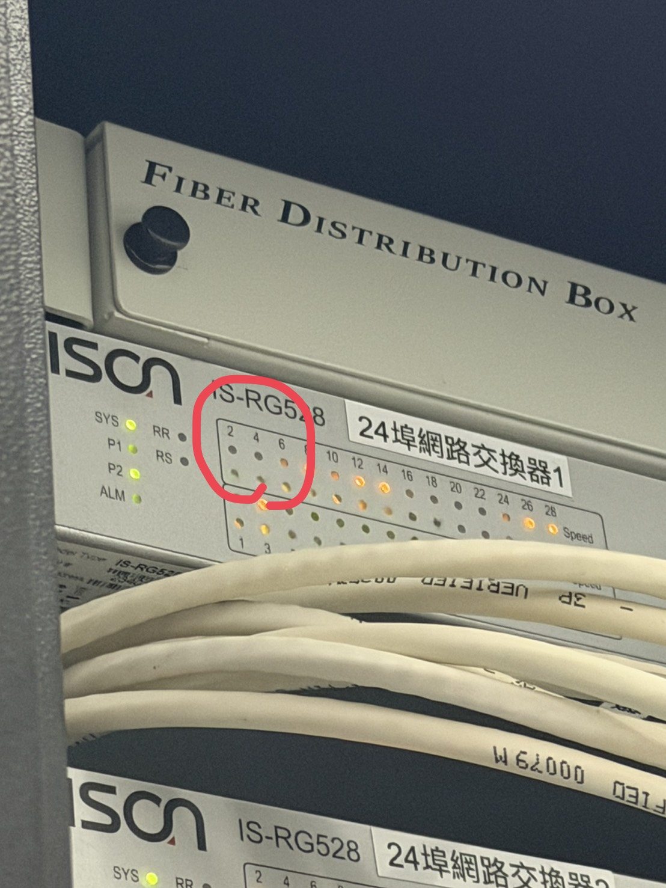
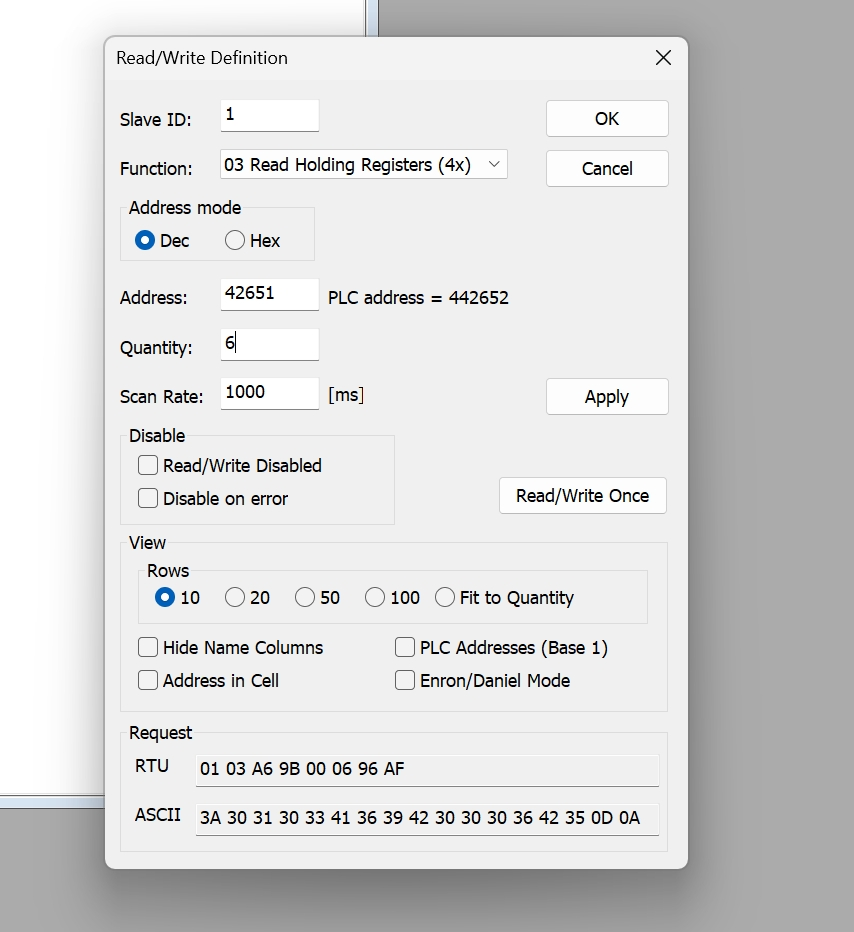
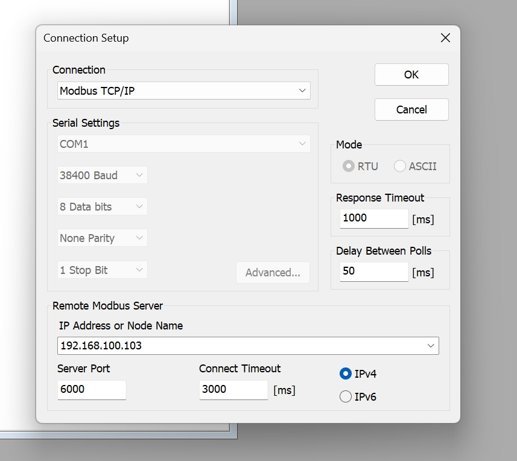
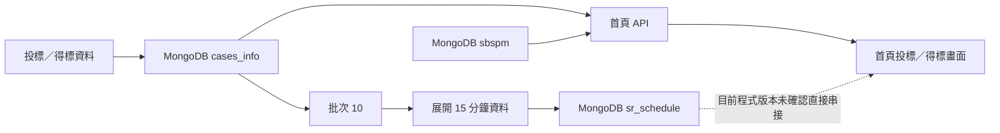

# 2026/08/13 工作紀錄

## 一、今日摘要

- 與 Stella、Luis 進行 ABB VCB 對表、IP 設定及重啟確認。
- 使用前端畫面與 Modbus Poll 核對設備數值及通訊狀態。
- 盤點批次設定、告警設備名稱與首頁投標／得標資料流程。
- 建立測試用空資料庫 `FEMC_EMS_LOCAL_empty`。

## 二、VCB 對表與網路檢查

| 項目 | 今日處理／判斷 |
|---|---|
| ABB VCB | 設定 IP 後，由 Stella、Luis 協助重啟。 |
| 異常確認 | 從前端畫面查看異常設備，再回到現場逐一核對。 |
| 網路線 | 核對頭尾、控制櫃燈號及對應線路，排除插錯線。 |
| IP 設定 | 確認設備 IP 是否設錯，並重新測試連線。 |
| 未接設備 | 部分設備尚未接上，後續需逐項確認原因。 |

### ABB REX615 燈號確認

- 現有 VCB 設定檔顯示設備為 **ABB REX615**。
- ABB 官方文件說明，REX615 前方 RJ-45 的**綠燈**代表網路線已成功連接，**黃燈閃爍**代表正在與連接設備通訊。
- 因此就 REX615 前方網路孔而言，黃／綠燈的差異不是速度；若看到的是交換器或其他網路設備燈號，仍需依該設備型號確認。
- 參考：[ABB REX615 Front communication](https://techdoc.relays.protection-control.abb/r/REX615-Operation-Manual/PCL1/en-US/Front-communication)

<figure style="border: 1px solid #999; padding: 12px; border-radius: 8px;display: inline-block; text-align: center; background-color: #f9f9f9;">
    
    <figcaption>abb light signal</figcaption>
</figure>

## 三、Modbus Poll 測試

### 操作流程

1. 由 `Connection → Connection Setup` 設定連線資訊，依客戶設備 Excel 填入設備／Proxy 位址。
2. 由 `Setup → Read/Write Definition` 設定測試點位。
3. 填入現場提供的 `Address`。
4. 設定 `Quantity`；一次讀取過多點位可能發生錯誤。
5. 按下 `Apply` 產生讀取結果，再與現場／前端數值核對。

<figure style="border: 1px solid #999; padding: 12px; border-radius: 8px;display: inline-block; text-align: center; background-color: #f9f9f9;">
    
    <figcaption>modbus pull setting address</figcaption>
</figure>
<figure style="border: 1px solid #999; padding: 12px; border-radius: 8px;display: inline-block; text-align: center; background-color: #f9f9f9;">
    
    <figcaption>modbus pull setting ip</figcaption>
</figure>

### 今日確認重點

- 檢查設備的讀取與寫入通訊。
- 透過 Modbus Poll 畫面核對電表及設備數值。
- 寫入測試前需再次確認設備、Address 與允許操作範圍。

## 四、批次與前端設定

### 批次設定待確認

- 確認是否已有 Email 設定。
- 核對設備名稱：`METER_MAIN`、`METER_SUN1`。
- 核對即時告警所顯示的設備名稱。
- 可先盤點批次 `10` 與 `00`，但不要直接啟動；部分批次可能立即寫入資料或控制設備。

### 批次 10／首頁資料流程

- 目前靜態整理結果顯示，批次 10 是從 MongoDB 讀取案件資料並寫入 `sr_schedule`，不是直接呼叫雲端 REST API。
- 目前首頁 API 讀取 `cases_info` 與 `sbspm`；是否與正式環境相同，仍需核對實際部署版本。
- 詳細批次說明：[EMS_BATCH_OVERVIEW.md](../02_系統文件/EMS_BATCH_OVERVIEW.md)

## 五、前端與功能確認

- 前端畫面需移除電瓶器項目。
- 3D 網址需由麗澤網址改為全興案場網址。
- 前端出現較多設備名稱，需確認設備清單與命名是否正確。
- 進行報表測試。

## 六、資料庫處理

- 因沒有雲端 Test 資料庫權限，在亞朔機器建立測試資料庫 `FEMC_EMS_LOCAL_empty`。
- 此資料庫以空資料表／Collection 為主，供後續測試使用。

## 七、部署流程補充

- 待補齊所有 Docker images 的準備流程。
- 待整理前端啟動後的檢查事項。
- 本項原本預計補入 08/12 紀錄；為避免修改舊資料，改記錄於本日。

## 八、下次出差準備

- [ ] 延長線。
- [ ] 多個塑膠袋，方便裝濕紙巾等垃圾。

## 九、後續待辦

- [ ] 追查尚未接上的設備與原因。
- [ ] 完成電表／設備數值核對。
- [ ] 確認 Email 與即時告警設備名稱設定。
- [ ] 移除前端電瓶器畫面。
- [ ] 更換 3D 網址。
- [ ] 確認新增設備名稱是否正確。
- [ ] 完成報表測試。
- [ ] 補齊 Docker images 與前端啟動檢查流程。
- [ ] 核對正式環境中批次 10 與首頁 API 的實際資料流。

---

### ✍️今天的碎碎念
天氣：晴朗
裝冷氣的來ㄌ 今天就是一直看批次的設定檔案
批次的部分可能可以想一下 設定檔能寫一些script可以讓我更快速的執行
感覺很多都需要畫流程圖
像是測試批次10我今天就知道要去看首頁有沒有顯示投標資料ㄌ
