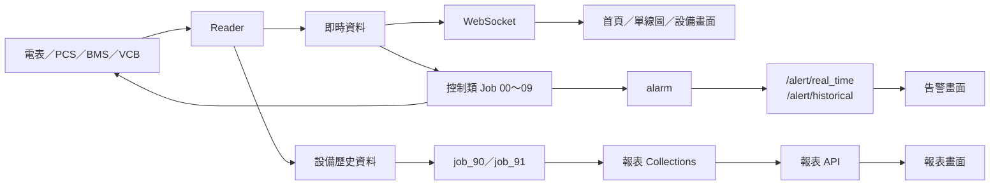
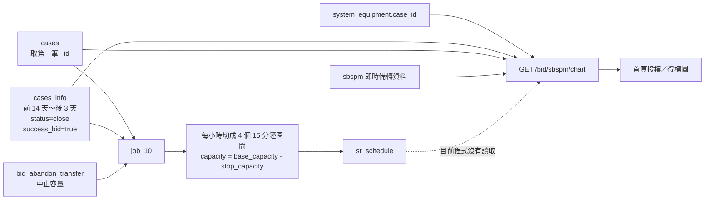

# 批次、API 與前端畫面對照

建立日期：2026/08/15  
更新日期：2026/08/15（← 0815 依目前程式碼重整）

## 一、先看結論

| 類型 | 資料流 | 代表項目 |
|---|---|---|
| ✅ 直接對應 | Batch → MongoDB → Backend API → 前端 | ECI、告警、一般報表、太陽能報表 |
| ◐ 間接影響 | Batch → PCS／BMS → Reader／WebSocket → 前端 | `job_00`～`job_07`、`job_09` |
| ❌ 目前無直接畫面 | Batch → MongoDB／外部服務，但 Backend API 未讀取 | `job_10`、資料清除、AWS 上傳 |

最重要的判斷：

- 跑完 `job_10` 只會更新 `sr_schedule`，**目前首頁 API 不會讀取它**。
- 控制類 Job 改變的是 PCS／BMS 與 `working_status`，前端主要透過 Reader／WebSocket 間接看到設備變化。
- `job_90`、`job_91` 才是「跑完批次後，報表畫面應出現資料」的直接關係。
- Batch 成功只代表程式完成；仍要依序確認 Collection、API 回傳與前端欄位。

## 二、核對範圍

| 系統 | 本次核對版本 |
|---|---|
| Batch | `D:\code\ems-batch`，分支 `prd/advanced-tek-qx`，Commit `ad6bb7e`（2026/08/14） |
| Backend API | `D:\code\dashboard-api-local`，分支 `master`，Commit `fc56393`（2026/08/14） |
| 案場 Backend Image | `ems-backend-api-local:adv-qx-v1.0.1` |
| 案場 Frontend Image | `advanced-tek-quanxing-frontend:production-v0.1.4` |

> 案場只有 Frontend Image，沒有全興前端原始碼。本文件的畫面名稱以案場 `menu_item.json` 為主，並使用共用前端專案確認 API 呼叫方式；標示「參考前端」的項目仍需在全興實際畫面再確認一次。

### 啟動前警告

目前 Batch 根目錄的 `config.ini` 是：

- `job_id = job_00_status_control`
- `schedule_type = interval`
- `interval_value = 1` 秒

因此不可為了看畫面直接啟動 Batch。程式只會載入 `job_id` 列出的 Job；原始碼中有某個 Job，不代表案場正在執行它。

## 三、整體資料流

### Reader 與 Batch 的差異

| 元件 | 主要工作 | 前端關係 |
|---|---|---|
| Reader | 讀設備、產生即時與歷史資料 | 即時值經 WebSocket 顯示；歷史值供查詢與報表使用 |
| Batch | 控制設備、計算排程／報表、發送通知 | 依 Job 分為直接顯示、間接影響或無畫面 |
| Backend API | 讀 MongoDB／歷史資料並回傳 | 前端 HTTP 查詢使用 |
| WebSocket | 推送 Reader 的即時設備值 | 首頁、單線圖與設備狀態使用 |

## 四、控制類 Job 對照

這一組大多沒有「批次結果 API」。前端看到的是設備被控制後，再由 Reader 讀回來的 PCS 功率、SOC、電表或狀態。

| Batch | 主要輸入 | 實際輸出／動作 | API 與前端 | 關係 |
|---|---|---|---|---|
| `job_00` 狀態控制 | PCS／BMU 即時資料、`working_status` | 更新 `working_status`；必要時關閉 PCS；寫 `job_operation_log`、`alarm` | 告警可由 `/alert/real_time`、`/alert/historical` 顯示；設備變化看首頁／單線圖 | 告警 ✅；設備 ◐ |
| `job_01` 保護控制 | 保護點位、系統設定、設備狀態 | PCS 功率歸零、關 PCS／BMS；寫操作紀錄與 `alarm` | 告警畫面直接顯示；PCS／BMS 狀態由 WebSocket 間接顯示 | 告警 ✅；設備 ◐ |
| `job_02` 逆送電保護 | 電表即時值、系統設定 | PCS 功率歸零；更新模式；寫操作紀錄並發通知 | 首頁／單線圖觀察電表與 PCS；無專用結果 API | ◐ |
| `job_03` 抑低用電 | 操作模式、抑低設定、台電假日、設備 | 計算並下 PCS 功率；更新模式、操作紀錄與通知 | 首頁／單線圖觀察 PCS 功率、SOC、電表 | ◐ |
| `job_04` 超約控制 | 契約容量、需量、電價設定、設備 | 計算並下 PCS 功率；更新模式、操作紀錄與通知 | 首頁／單線圖觀察總用電與 PCS 功率 | ◐ |
| `job_05` 排程充放電 | `charge_schedule`、操作模式、SOC、電表 | 依排程下 PCS 功率；更新模式、操作紀錄與通知 | 排程設定由 `/electric/schedule` 維護；執行結果看即時設備值 | ◐ |
| `job_06` 太陽能自動補電 | 操作模式、太陽能／電表、SOC | 計算補電功率並寫 PCS；更新模式與操作紀錄 | 太陽能、PCS、SOC 畫面間接反映 | ◐ |
| `job_07` 自動離峰充電 | 電價設定、台電假日、電表、SOC | 離峰時段下 PCS 充電功率；更新模式、紀錄與通知 | 首頁／單線圖觀察 PCS 與 SOC | ◐ |
| `job_08` 抑低到期通知 | 系統設定 | 發送 `DEADLINE_POWER_CONTROL` 通知 | 訊息群組；若訊息服務有留 Log，可在「發送紀錄」查詢 | ◐ |
| `job_09` 即時備轉控制 | `working_status`、備轉狀態、PCS | 進入／解除備轉、調整 PCS 功率、寫操作紀錄 | PCS 功率由 WebSocket 間接顯示；無 `working_status` 查詢 API | ◐ |

補充：目前 Backend 會在手動控制與電池校正時讀取 `working_status`，避免不同控制模式互相搶設備；但沒有一般前端可直接查詢 `working_status` 或 `job_operation_log` 的 API。

## 五、資料與報表 Job 對照

| Batch | 主要輸入 | 寫入／動作 | 對應 API | 對應畫面 | 關係 |
|---|---|---|---|---|---|
| `batch_eci` | BMS 歷史資料、ECI 門檻設定 | `essci` | `GET /ems/essci` | 櫃體／Rack ECI 圖（參考前端：`CabinetESSCI`、`RackECI`） | ✅ |
| `job_10` 備轉排程 | `cases`、`cases_info`、`bid_abandon_transfer` | `sr_schedule` | **目前沒有 API 讀取** | **目前沒有直接對應畫面** | ❌ |
| `job_90` 一般報表 | 電表歷史資料、電價設定 | `report_hourly`、`report_daily`、`report_monthly`、`report_yearly` | `GET/POST /report/cabinet_data`、`POST /report/cabinet_chart_data` | 「儲能系統報表」／`CabinetReports` | ✅ |
| `job_91` 太陽能報表 | DCU／Inverter／日照歷史資料 | `report_daily_sun`、`report_monthly_sun`、`report_yearly_sun` | `POST /inverter/get_data` | 太陽能報表／`SunCabinetReports`（參考前端） | ✅ |
| `job_92` 定期清除 | 舊的 DCU、需量、操作紀錄、日照、備轉排程 | 刪除逾期資料 | 無專用 API | 無直接畫面；可能使舊資料不再可查 | ❌ |
| `job_93` 太陽能上傳 | DCU、日照資料 | 上傳 AWS；更新 DCU 上傳狀態 | 無地端查詢 API | 無直接畫面 | ❌ |

## 六、`job_10` 詳細資料流

### `job_10` 實際處理

1. 從 `cases` 取得第一筆 `_id` 當作 `case_id`。
2. 查詢前 14 天到後 3 天的 `cases_info`。
3. 只保留 `status=close`、`success_bid=true`、`capacity > 0` 的資料。
4. 每小時拆成 `00`、`15`、`30`、`45` 分四個區間。
5. 若有中止資料，計算 `capacity = base_capacity - stop_capacity`。
6. 依 `case_id + datetime + start_time + end_time` Upsert 至 `sr_schedule`。

### 首頁 API 實際處理

`GET /bid/sbspm/chart` 讀取的是：

- `system_equipment`：取得本案場的 `case_id`。
- `cases`：取得案件代碼。
- `cases_info`：取得今天每小時的投標／得標容量。
- `sbspm`：取得即時備轉曲線。

因此：

- `job_10` 成功：應先確認 `sr_schedule` 是否產生 15 分鐘資料。
- 首頁沒資料：應查 `system_equipment.case_id`、今天的 `cases_info` 與 `sbspm`，不能只查 `sr_schedule`。
- `job_10` 和首頁可能使用不同的案件範圍：Job 取 `cases` 第一筆，API 取 `system_equipment` 綁定的案件。

### 目前程式風險

- `/bid/sbspm/chart` 回傳時，`close_capacity` 目前誤放成 `quote_capacity_list`，可能造成投標與得標線相同。
- API 的 `today_date` 在模組載入時建立；服務若跨日未重啟，需留意日期是否仍是前一天。
- 沒有 API 讀取 `sr_schedule`，所以目前無法從前端直接驗證 `job_10` 的產出。

## 七、通知、告警與特殊 Job

| Batch | 實際行為 | API／畫面 | 關係 |
|---|---|---|---|
| `job_94` 告警通知 | 依告警等級組訊息，使用 `SYSTEM_ALARM_0/1/2` 規則發送 | 訊息群組；`GET /femc_msg/log` →「發送紀錄」需由訊息服務實際留存 | ◐ |
| `job_95` Switch／Forti 監測 | 目前 Forti Ping 結果會寫入 `alarm`；Switch 告警程式被註解 | `/alert/real_time`、`/alert/historical` → 告警畫面 | Forti ✅；Switch ❌ |
| `job_100` 觀音備轉 | MQTT 與 ADAM-6060 IO 控制 | 全興沒有直接對應 API／畫面 | ❌，非全興功能 |

## 八、API 與畫面快速索引

| 資料來源 | Backend API | 前端位置 | 確認程度 |
|---|---|---|---|
| `alarm` | `/alert/real_time`、`/alert/historical` | 即時／歷史告警 | ✅ API 已確認；全興選單位置需現場確認 |
| `essci` | `/ems/essci` | 櫃體／Rack ECI | ◐ 共用前端已確認 |
| `report_hourly/daily/monthly/yearly` | `/report/cabinet_data`、`/report/cabinet_chart_data` | 儲能系統報表 `CabinetReports` | ✅ 案場選單已確認 |
| `report_*_sun` | `/inverter/get_data` | 太陽能報表 `SunCabinetReports` | ◐ 共用前端已確認 |
| 訊息服務 Log | `/femc_msg/log` | 即時訊息設定 → 發送紀錄 | ✅ 案場選單已確認 |
| `cases`、`cases_info`、`sbspm` | `/bid/sbspm/chart` | 首頁投標／得標圖 | ✅ Backend 用途已確認；全興前端原始碼缺少 |
| `sr_schedule` | 無 | 無直接畫面 | ❌ |
| `working_status` | 無一般查詢 API | 無直接畫面 | ❌ |
| `job_operation_log` | 無 | 無直接畫面 | ❌ |

補充：`/meter/get_data`、`/pcs/get_data`、`/bms/get_data` 分別對應「電錶資料查詢」、「PCS 資料下載」、「BMS 資料下載」，資料來源是 Reader 歷史資料，不是上述 Batch 直接寫入。

## 九、執行後的確認順序

### 控制類 Job（`00`～`09`）

1. 看 Batch Log 與 `job_operation_log`。
2. 確認 `working_status` 是否符合預期。
3. 直接確認 PCS／BMS 實際命令與狀態。
4. 確認 Reader 有重新讀到新值。
5. 最後看首頁／單線圖的 WebSocket 數值與告警畫面。

### 報表類 Job（`90`、`91`）

1. 看 Batch Log。
2. 確認對應報表 Collection 有資料。
3. 呼叫對應 API 核對日期、設備與數值。
4. 最後確認前端報表與下載檔。

### `job_10`

1. 確認 `cases` 第一筆是否為正確案件。
2. 確認 `cases_info` 的 `close`／`success_bid` 資料。
3. 確認 `bid_abandon_transfer`。
4. 確認 `sr_schedule` 15 分鐘資料。
5. 若要查首頁，另外核對 `system_equipment.case_id`、`cases_info` 與 `sbspm`。

詳細 Job 行為：[EMS_BATCH_OVERVIEW.md](./EMS_BATCH_OVERVIEW.md)
