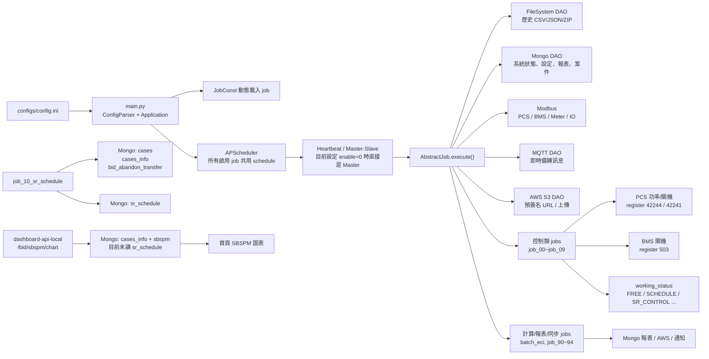
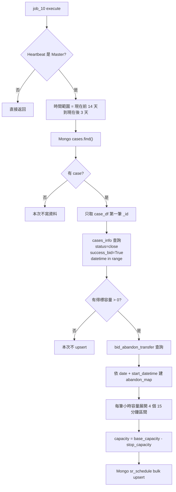
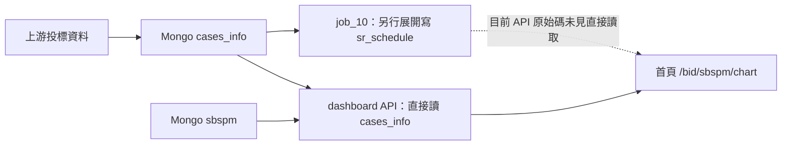
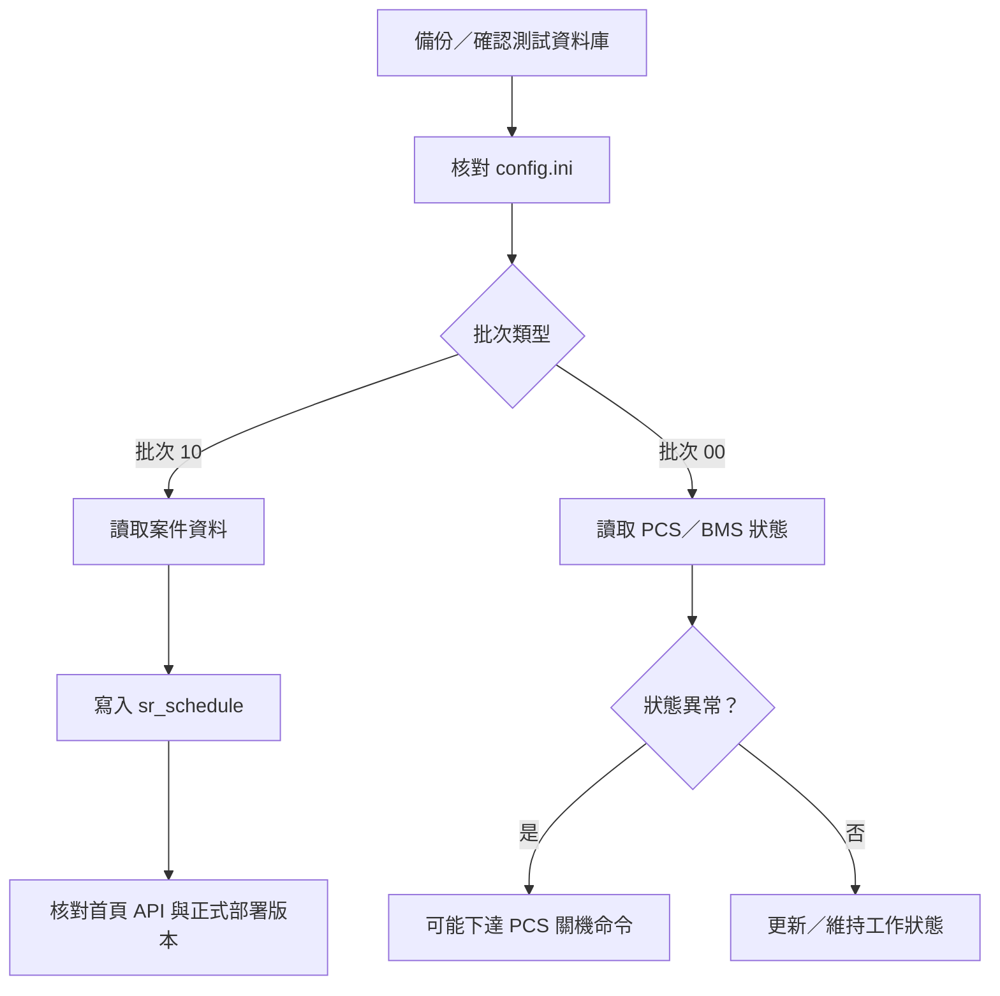

# EMS-Batch 批次程式整理與架構核對

盤點日期：2026-08-13

本文件是以靜態閱讀 `D:\\code\\ems-batch` 原始碼，以及核對 `D:\\code\\dashboard-api-local` 目前 API 原始碼所得。未啟動 `main.py`、未呼叫任何批次 job、未連線或寫入設備。

## 先講結論

1. 這個專案的控制核心是 Modbus。`job_00`～`job_09` 中多支程式會讀取 PCS/BMS/電表，並可能寫入 PCS 功率或關機命令；`test_scan_freq.py`、`test_step_test.py` 更是直接對 PCS 下測試功率，必須視為高風險程式。
2. `main.py` 會讀 `configs/config.ini`，依 `SETTINGS.job_id` 動態載入 job。所有被載入的 job 共用同一組 APScheduler 設定，不會依各檔案 docstring 自動變成「每秒／每 5 秒／每天」各自的頻率。
3. `job_10_sr_schedule.py` 本身沒有呼叫 REST API，也沒有呼叫 `sync_uri`；它直接查 MongoDB 的 `cases`、`cases_info`、`bid_abandon_transfer`，再寫 MongoDB 的 `sr_schedule`。
4. 在目前 `dashboard-api-local` 原始碼中，對應首頁 SBSPM 圖表的 `/bid/sbspm/chart` 讀的是 `cases_info` 與 `sbspm`，沒有讀 `sr_schedule`。因此目前看不到「首頁投標／得標資料直接來自 job_10」的程式串接；`job_10` 比較像供其他備轉控制或其他版本 API 使用的排程快照。
5. API 端目前還有一個明顯欄位錯誤：`close_capacity` 回傳值誤放成 `quote_capacity_list`，位置在 `D:\\code\\dashboard-api-local\\apps\\dashboard\\api_v1\\api\\bid_sbspm_chart.py:99`。

## 標記方式

- 🔴 可能直接控制設備：Modbus register／coil write、MQTT/PLC IO write。
- 🟠 會寫入資料庫、雲端、通知或刪除資料。
- 🟢 讀取、計算、顯示或只做健康檢查。
- ⚠️ 測試／刪除／啟動時需人工確認。

## 整體架構



### 啟動、排程與主從

- `D:\\code\\ems-batch\\main.py:182` 固定讀 `./configs/config.ini`；不會依參數自動切到 `config_prd.ini`。
- `SETTINGS.job_id` 是逗號分隔的 job 名稱。只有存在於 `JobConst.list()` 的名稱才會載入。
- `main.py:116-131` 對每個已載入 job 都套用同一個 cron 或 interval 設定。檔案內的「每秒一次」「每天 6:00」是說明文字，不是獨立排程設定。
- 每個 job 另外都會被加入每分鐘一次的 `send_alarm_message`，用來彙整告警。
- 目前兩份 ini 的 `job_id` 都是空值；若沒有外部部署流程改寫設定，直接啟動不會載入任何 job。
- 目前設定 `HEARTBEAT.enable=0`，所以 `HeartbeatController` 直接把自己視為 Master；多實例時不會進行主從互斥。

## 每一支批次程式

### 1. `batch_eci.py` — ESSCI / ECI 電池健康指標

- 類別：`BatchECI`。
- 來源：FileSystem 的 `bmu_*` 歷史資料，解析每個 rack 的 cell voltage、temperature、terminal temperature。
- 計算：依設定的 rack 數量與 ECI threshold，產生每個 rack 的 ECI，以及整站 ESSCI／ICI／RAW。
- 輸出：Mongo `essci` upsert；每半小時刪除 4 小時以前的 `essci`。
- 設備控制：🟢 沒有 Modbus write；只有告警訊息。
- 注意：資料中的 `rack_list` 會被字串解析，且使用 `eval` 處理 `datetime.datetime(...)` 片段，應把輸入視為受信任資料。

### 2. `job_00_status_control.py` — 系統 working status 狀態機

- 類別：`StatusControl`。
- 主要來源：Mongo `system_current_data` 取得 PCS/BMU 狀態；直接讀 PCS `42241` 判斷黑啟動命令。
- 主要邏輯：
  - PCS 任一正常才視為整體可用；PCS 都不正常時設定 `NOT_AVAILABLE`。
  - BMU_1/BMU_2 掛 PCS_1；BMU_3/BMU_4 掛 PCS_2。
  - BMS 狀態異常累計超過門檻，會關閉所屬 PCS。
  - FREE、手動、排程、抑低、超約、自動補電、AUTO、Modbus 等狀態若閒置超過 10 秒且 PCS 設定功率為 0，會回到 FREE。
- 設備控制：🔴 可能呼叫 `shutdown_pcs()`。
- 寫入點位：PCS 功率 `42244=0`、PCS 斷開電池 `42241=129`。
- 風險：這支是狀態總管，但同時有保護性關機行為；若 `system_current_data`、`working_status` 資料過期或多個 job 同時跑，可能造成狀態與實際 PCS 出力不同步。

### 3. `job_01_protection_control.py` — PCS/BMS 保護與斷電處理

- 類別：`ProtectionControl`。
- 執行意圖：每秒從 `FEMC_MODBUS` 讀保護 coil。
- 讀取範圍：
  - PCS：coil 1～6。
  - BMS_1：100～112；BMS_2：120～132；BMS_3：140～152；BMS_4：160～172。
  - 每櫃讀 12 個 coil，包含通訊、OV、UV、OC、OT、UT、火災等狀態。
- 保護動作：
  - 火警：全場 PCS + 四櫃 BMS 關閉。
  - PCS 通訊異常：關閉其下 BMS 與 PCS。
  - BMS 通訊異常：關閉所屬 PCS 與 BMS。
  - 二階保護、SOC 到上下限：關閉或將所屬 PCS 功率設為 0。
  - 電網異常持續 30 秒：兩台 PCS 功率歸 0。
  - FREE 模式下若 PCS 仍有出力：兩台 PCS 功率歸 0。
- 設備控制：🔴 高風險，會呼叫 `shutdown_bms()`、`shutdown_pcs()`、`set_pcs_power(..., 0)`。
- 特別注意：讀不到 coil 不採 fail-open，而是各段連續超過 2 次才視為故障；但一旦判定故障就會下關機命令。

### 4. `job_02_reverse_power.py` — 逆送電保護

- 類別：`ReversePowerControl`。
- 來源：Mongo `system_current_data` 的 `METER_MAIN` 與 `METER_SUN`，以及 `system_settings.enable_reverse_power_detect`。
- 邏輯：用高壓用電與太陽能發電量判斷是否有逆送；偵測到時設定 `REVERSE_POWER_MODE`。
- 動作：🔴 兩台 PCS 都寫功率 0；解除時恢復 `FREE`。解除條件為持續一段時間沒有逆送，程式實作為 5 秒。
- 注意：此 job 會和排程、抑低、超約等控制 job 競爭 PCS 功率命令；靠 `working_status` 互斥，但仍應確保同一時間只有一個 Master。

### 5. `job_03_power_control.py` — 抑低用電

- 類別：`PowerControl`。
- 啟用條件：`automatic_power_control`、抑低起訖日期、非週末／非台電假日、非 Modbus 遠端模式，且 SOC 仍高於保護值。
- 計算來源：高壓電表、PCS 實際功率、四櫃 SOC、FEMC 保護 coil、`power_control_settings`。
- 控制方式：
  - 估算場內目前功率與設定目標值差異。
  - 以 PCS 額定功率、可充放狀態與 SOC 分配功率。
  - 背景執行緒每秒進行兩次控制。
- 設備控制：🔴 會反覆寫入兩台 PCS 的 `42244`。
- 重要狀態：設定 `POWER_CONTROL`，結束時兩台 PCS 都寫 0 並回 FREE。
- 目前註冊狀態：⚠️ `job_03_power_control.py` 存在，但沒有被 `JobConst` 註冊，因此透過 `main.py` 的 `job_id` 無法載入；若現場有跑，可能是其他版本、手動啟動或部署流程另有處理。

### 6. `job_04_needed_power.py` — 超約／需量控制

- 類別：`NeededControl`。
- 啟用條件：`automatic_demand`，並檢查季節電價、台電假日、契約／自動容量、PCS 可用容量、SOC 與 UV 保護。
- 來源：電價設定、台電假日、`energy_demand` 的 15 分鐘需量、PCS/BMS 即時資料與設備規格。
- 動作：計算剩餘可影響功率，僅允許放電方向，依 PCS/SOC 分配；設定 `CONTRACT_MODE`。
- 設備控制：🔴 會寫兩台 PCS `42244`；結束或連續錯誤達門檻會寫 0。
- 注意：此 job 在 `load_pcs_spec()` 失敗時會停止控制；這比套用內建預設容量安全，但需要確認現場 `equipments` 資料完整。

### 7. `job_05_charge_discharge_schedule.py` — 手動充放電排程

- 類別：`ChargeDischargeSchedule`。
- 來源：Mongo `electric_schedule_detail`，以及電價、台電假日、設備規格、四櫃 SOC、PCS／電表、FEMC OV/UV coil。
- 邏輯：依目前星期、時間、排程 `type`、目標 SOC、固定 kW 或 SOC 估算功率；支援太陽能併網類型與需量限制。
- 動作：依 `pcs_power_cal()` 分配到兩台 PCS；考慮 PCS 電壓／溫度降容曲線、SOC、OV/UV、最大電流與場內保留用電。
- 設備控制：🔴 會反覆寫兩台 PCS `42244`；排程結束或連續錯誤會兩台歸 0。
- 狀態：使用 `SCHEDULE`；通知開始／結束。

### 8. `job_06_replenishment_power.py` — 太陽能自動補電

- 類別：`ReplenishmentPower`。
- 啟用條件：`enable_auto_replenishment`，且 `solar_type=2` 餘電躉售；`solar_type=0/1` 不執行。
- 觸發：太陽能功率高於安全餘裕，且場內實際用電低於太陽能發電量，代表可能逆送，因此用 PCS 吸收多餘電力。
- 來源：Mongo 電表即時資料、設備規格、四櫃 SOC、FEMC OV coil。
- 設備控制：🔴 只允許充電方向，分配並寫入兩台 PCS `42244`；結束時兩台歸 0。
- 注意：docstring 已明確寫「不含 inverter 關閉」；這支只做 PCS 充電，不會關閉逆變器。

### 9. `job_07_auto_charge.py` — 自動離峰充電

- 類別：`AutoCharge`。
- 啟用條件：`charge_type=1`、目前為台電離峰時段、非其他控制模式、非 Modbus 遠端模式。
- 來源：電價、離峰時段、台電假日、PCS/BMS、設備規格、電表與電流設定。
- 邏輯：計算剩餘離峰時間與目標 SOC，依需量限制、最大電流、太陽能類型、OV 保護決定充電功率。
- 設備控制：🔴 寫兩台 PCS `42244`；離峰結束、SOC 達上限或連續錯誤時歸 0。
- 狀態：使用 `AUTO`；通知開始／結束。

### 10. `job_08_power_control_deadline.py` — 抑低排程起訖通知

- 類別：`PowerControlDeadline`。
- 來源：Mongo `system_settings`。
- 邏輯：依 `power_control_warning_n_day`、`power_control_alarm_n_day`，在抑低開始／結束前的指定天數發通知。
- 設備控制：🟢 不寫設備；只透過通知規則發訊息。
- 注意：docstring 寫每天 08:00 與 22:00，但實際是否在這兩個時間執行，取決於 `main.py` 的全域排程設定；程式本身沒有建立獨立的 08:00／22:00 排程。

### 11. `job_09_sr_process_control.py` — 即時備轉履約／待命量控制

- 類別：`SRProcessControl`。
- 來源：`SRProcess` 讀案件、當日得標、目前中止、調度狀態與 CBL；設定讀 `enable_spinning_reserve_compensate`、CBL 差值與係數。
- `Processing`：得標執行中，兩台 PCS 強制輸出 0，避免其他功率干擾履約。
- `StandardBy`：若 CBL 換算後接近或低於得標容量，逐步把 PCS 放電功率每次降低 100 kW，提高待命量；必要時切換 `SR_CONTROL`。
- `NoBids`、`Abandon`、`Recover`：若原本在 SR 模式，兩台 PCS 歸 0 並回 FREE。
- 設備控制：🔴 會寫兩台 PCS `42244`，包括歸 0 與逐步減少放電。
- 注意：`SRProcess` 使用的目前得標／中止查詢是即時 Mongo 查詢，不是 `job_10` 產生的 `sr_schedule`；兩條資料路徑要分開理解。

### 12. `job_10_sr_schedule.py` — 投標／中止容量展開成 15 分鐘排程

- 類別：`SrSchedule`。
- 執行頻率說明：docstring 寫 30 秒一次；實際頻率仍由 `main.py` 全域 schedule 決定。
- 設備控制：🟢 不讀寫 Modbus，不會直接控制 PCS/BMS。
- 輸入集合：Mongo `cases`、`cases_info`、`bid_abandon_transfer`。
- 輸出集合：Mongo `sr_schedule`。
- 詳細流程見下方「job_10 與首頁 API 核對」。

### 13. `job_90_report_generator.py` — 一般電表報表

- 類別：`ReportGenerator`。
- 來源：FileSystem 歷史檔案 `meter_METER_MAIN*`、`meter_METER_SUN*`、`meter_METER_VCB*`，另讀 Mongo 電價設定。
- 計算：將累積電度轉成 15 分鐘資料，再聚合小時、日、月、年報；計算工廠用電、PCS 充放電度數、尖峰／半尖峰／離峰費用。
- 輸出：Mongo `report_hourly`、`report_daily`、`report_monthly`、`report_yearly`。
- 設備控制：🟢 不寫設備；🟠 寫報表資料庫。
- 注意：VCB 缺資料會警告後以 0 計入報表；現場需確認 `METER_VCB_1/2` 是否真的有接上。

### 14. `job_91_report_generator_sun.py` — 太陽能報表

- 類別：`ReportGeneratorSun`。
- 來源：FileSystem 的 DCU／inverter 歷史檔案與 `solar_exposure*`，Mongo `equipments` 取得 DCU／inverter 容量。
- 計算：按小時聚合 AC 能量，依 inverter 比例拆分，整合日照量，產生 IRR／PR。
- 輸出：Mongo `report_daily_sun`、`report_monthly_sun`、`report_yearly_sun`。
- 設備控制：🟢 不寫設備；🟠 寫報表資料庫。
- 注意：輸入資料中的 inverter list 會使用 `eval` 解析，需確認資料來源可信。

### 15. `job_92_schedule_remove_data.py` — 舊資料刪除

- 類別：`ScheduleRemoveData`。
- 動作：🟠 直接刪 Mongo 資料。
  - 刪除兩天以前的 `job_operation_log`、`energy_demand`。
  - 刪除八天以前的 `sr_schedule`。
- 設備控制：🟢 不控制設備。
- 注意：docstring 寫「三天／九天以前」，實作的 cutoff 是 `now - 2 days` 與 `now - 8 days`，需確認是否符合業務定義。這支是不可逆資料刪除，啟用前需備份與確認時區。

### 16. `job_93_schedule_upload_sun_data.py` — 太陽能資料上傳 AWS

- 類別：`ScheduleUploadSunData`。
- 來源：Mongo `dcu`、`solar_exposure`，抓目前時間往前約 2 分鐘到本分鐘的資料。
- 動作：整合日照後轉成 `SolarEdgeData`，透過 AWS S3 DAO 取得上傳 URL 並上傳；成功後更新 `dcu.uploaded_flag=True`。
- 設備控制：🟢 不控制設備；🟠 寫 AWS 與 Mongo 上傳狀態。
- 注意：這是確實的雲端資料上傳路徑，但不是 `job_10` 的投標資料路徑。

### 17. `job_94_alarm_notify.py` — 系統告警通知

- 類別：`AlarmNotify`。
- 來源：Mongo `system_settings` 與 `alarm`，查最近 10 分鐘及尚未解除的告警。
- 動作：依告警 level 與本機 `configs/sent_alarm_log.csv` 去重／節流，再透過告警規則發送低、中、高等級通知。
- 設備控制：🟢 不控制設備；🟠 寫本機通知紀錄檔與通知服務。
- 注意：檔案路徑是相對路徑 `configs/sent_alarm_log.csv`，由工作目錄決定；容器或多實例部署時可能各自有一份紀錄。

### 18. `job_95_switch_tester.py` — 網路設備連線測試

- 類別：`SwitchTester`。
- 動作：目前實際只 ping `192.168.100.254` 的 Forti；Switch ping 區段被註解。
- 連續異常後寫 `FORTI` 告警，再交給告警處理器。
- 設備控制：🟢 不控制能源設備；🟠 會寫告警資料。
- 注意：使用 `os.system("ping -c 1 ...")`，參數是固定字串；此命令列選項偏 Unix，Windows 執行環境可能不符合預期。

### 19. `job_100_gi_process.py` — 觀音廠即時備轉 MQTT/PLC IO

- 類別：`GISpinningReserve`。
- 來源：MQTT 訂閱 START／END 指令；FileSystem 的 `meter_METER_MAIN*`。
- 動作：
  - 收到最近 1 分鐘內的 START：寫 IO ON，回讀 coil 18/19 確認成功後才 publish 履約回報。
  - 收到 END：寫 IO OFF，回讀確認後 publish 回報。
  - 每 10 秒送一次電表資訊到 MQTT publish topic。
- 設備控制：🔴 寫 ADAM-6060 DO coil 18（指令）、19（燈號）。
- 優點：此支有做寫入後回讀驗證；寫入失敗不回報台電履約。
- 啟動注意：程式期待 `IO_TCP` section；目前 `configs/config.ini`／`config_prd.ini` 的盤點結果沒有看到對應 `IO_TCP`，需要核對部署時是否另注入設定。

### 20. `heartbeat_test.py` — 心跳／健康分數測試

- 類別：`HeartbeatTest`。
- 動作：記錄目前 Master/Slave 與分數，每執行 10 次扣 5 分。
- 設備控制：🟢 不控制設備。
- 注意：這是測試 job，不應和正式控制 job 一起啟用。

### 21. `show_gui_data.py` — 本機 Tk GUI 即時顯示

- 類別：`ShowGuiData`／`DataViewer`。
- 來源：FileSystem 的 `bmu_HITHIUM_1*` 最新資料，解析 warning 欄位顯示在 Tk Treeview。
- 設備控制：🟢 目前沒有寫設備；雖然建構子會讀 `IO_PLC`，但此檔案沒有使用 `io_client` 下命令。
- 注意：GUI 的背景 thread 直接更新資料，資料為空時 `data[0]` 可能造成例外；只適合本機診斷用途。

### 22. `test_scan_freq.py` — PCS 掃頻測試

- 類別：`TestScanFreq`。
- 動作：依 60 Hz 附近頻率曲線計算功率，直接對 PCS `42244` 寫測試功率；結束或例外時寫 0。
- 設備控制：🔴 極高風險，是真正的 PCS 功率測試，不是單元測試。
- 目前相容性：檔案註解已說尚未適配雙 PCS 全興拓撲，仍期待不存在的 `[PCS]` section，且額定功率 727 是舊案場測試值。

### 23. `test_step_test.py` — PCS 步階測試

- 類別：`TestStepTest`。
- 動作：依 `727 kW -> 0 kW` 步階，或另一組頻率步階，直接寫 PCS `42244`；每階等待 900 秒。
- 設備控制：🔴 極高風險；例外時寫 0，但正常完成也只是最後 log，需人工確認 PCS 已回到安全狀態。
- 目前相容性：和 `test_scan_freq.py` 一樣尚未適配雙 PCS，期待不存在的 `[PCS]` section。

## 共用設備點位與寫入表

以下是從 `src/func_lib/machine_control.py` 與測試工具直接核對出的點位；實際地址仍應以現場設備 mapping／Modbus 文件為準。

| 功能 | Modbus 點位 | 讀寫 | 影響 |
|---|---:|---|---|
| PCS 設定功率 | holding register 42244 | 寫入 | 🔴 改變 PCS 充放電功率 |
| PCS 關機／斷開電池 | holding register 42244=0、42241=129 | 寫入 | 🔴 功率歸零並斷開電池 |
| BMS 電源 | input register 503 讀；503=2 寫 | 讀／寫 | 🔴 BMS 關機 |
| BMS 系統狀態 | input register 43 | 讀取 | 保護判斷 |
| BMS SOC | input register 4 | 讀取 | 充放電限制 |
| PCS 運轉狀態／有效功率 | holding registers 42497 起、讀 2 | 讀取 | 控制計算 |
| 主電表總有功 | holding registers 13696 起、讀 2 | 讀取 | 需量／逆送／排程 |
| 15 分鐘預測功率 | input registers 14628 起、讀 2 | 讀取 | 需量／充電計算 |
| 電表平均電流 | holding registers 13720 起、讀 2 | 讀取 | 充電電流限制 |
| 電表頻率 | input registers 14468 起、讀 2 | 讀取 | 停電判斷 |
| 電表累計 kWh | holding registers 14720 起、讀 4 | 讀取 | 報表／上傳 |
| FEMC BMS 保護 coil | base 100/120/140/160，各讀 12 | 讀取 | OV/UV 等保護判斷 |
| ADAM-6060 即時備轉 IO | coil 18、19 | 寫入／回讀 | 🔴 履約 START/END、燈號 |

### 共用控制函式的風險

`set_pcs_power()`、`shutdown_pcs()`、`shutdown_bms()` 內部多處使用裸 `except: pass`。因此呼叫端可能以為命令已成功，但實際 Modbus write 可能失敗；除了 `job_100` 的 IO 有回讀驗證，其他 PCS/BMS write 大多沒有「寫入結果驗證」。

## `job_10_sr_schedule.py` 與首頁 API 核對

### job_10 實際流程



實作細節：

- 日期範圍是 `now - 14 days` 到 `now + 3 days`，傳給 DAO 的格式是 `YYYYMMDD` 字串。
- 得標條件是 `cases_info.status == "close"` 且 `success_bid == True`，並排除 `capacity` 為空、0 或負值。
- 每一筆 `cases_info` 的小時資料會展開為 `00:00`、`00:15`、`00:30`、`00:45` 四筆。
- 若同一日期／小時的 `bid_abandon_transfer.start_datetime` 對到該 15 分鐘起點，則 `stop_capacity` 扣除；輸出 `abandon_flag=True`。
- 最後使用 `case_id + datetime + start_time + end_time` 作為 upsert key 寫入 `sr_schedule`。

### 目前 dashboard API 的實際流程

目前 API 路由是：

- `D:\\code\\dashboard-api-local\\apps\\dashboard\\api_v1\\routes.py:139`
- `GET /bid/sbspm/chart`

API `D:\\code\\dashboard-api-local\\apps\\dashboard\\api_v1\\api\\bid_sbspm_chart.py` 的讀取順序是：

1. `get_system_equipment(field_id=[field_id])` 取得此場站綁定的 case id。
2. `get_cases_info_many(case_id_list=..., date_list=[today_date])` 直接取得當天 `cases_info`。
3. `get_cases_many(...)` 取得 case code。
4. `get_SBSPM_local(...)` 取得 `sbspm` 資料。
5. 每個小時依 `status == quote` 與 `status == close` 組出 `quote_capacity`、`close_capacity`。

API 對應的 Mongo collection 是：

- `system_equipment`
- `cases_info`
- `cases`
- `sbspm`

這條路徑沒有讀 `sr_schedule`。所以目前可得的結論是：



### API 發現的問題

`bid_sbspm_chart.py:99` 回傳物件寫成：

```python
{
    'quote_capacity': quote_capacity_list,
    'close_capacity': quote_capacity_list,
}
```

`close_capacity` 應該很可能是 `close_capacity_list`。因此即使 Mongo `cases_info` 的 quote／close 都正確，首頁仍可能把「投標容量」顯示成「得標容量」。這是 API 端問題，不是 `job_10` 的 `sr_schedule` 計算問題。

另外，`job_10` 目前只取 `cases.find()` 的第一筆 case；API 則依 `system_equipment` 取得一個或多個 case。若場站有多個備轉案件，兩邊的 case 範圍可能不一致。

## REST API 核對結果

`ems-batch` 有一個通用 `ApiController`：

- `D:\\code\\ems-batch\\src\\components\\api_controller.py:54` 提供 GET／POST／DELETE。
- `D:\\code\\ems-batch\\src\\components\\abstract_job.py:39` 每個 job 建立 `ApiController`。
- 但全專案搜尋後，沒有任何 job 呼叫 `get_api_response()`。
- `sync_uri = https://ems.femctw.com/api/v1/` 目前只被讀入並產生 token，沒有形成實際 REST 請求。

因此不要把 `job_10` 的「雲端撈資料」理解成這個 REST API；以目前程式來看，它是直接走 Mongo DAO。若 Mongo 位址在遠端，資料是遠端 Mongo，但仍不是 HTTP API。

實際會用外部 HTTP／雲端的批次主要是：

- `job_93_schedule_upload_sun_data.py` → AWS S3 上傳。
- `alarm_controller.py` → FEMC message service、LINE、Email 等通知路徑，依設定啟用。

## 高風險啟動清單

### 第一級：啟動就可能改變設備狀態

- `job_01_protection_control.py`：異常條件下會關 PCS/BMS。
- `job_00_status_control.py`：BMS/PCS 狀態異常時會關 PCS。
- `job_02_reverse_power.py`：偵測逆送時兩台 PCS 歸 0。
- `job_03_power_control.py`：抑低用電，持續寫 PCS 功率；雖目前未註冊，仍要確認部署。
- `job_04_needed_power.py`：超約放電控制。
- `job_05_charge_discharge_schedule.py`：充放電排程控制。
- `job_06_replenishment_power.py`：太陽能餘電自動充電。
- `job_07_auto_charge.py`：離峰自動充電。
- `job_09_sr_process_control.py`：即時備轉履約／待命量控制。
- `job_100_gi_process.py`：START／END 會寫 ADAM-6060 IO。
- `test_scan_freq.py`、`test_step_test.py`：直接下 PCS 測試功率，最不應在正式服務容器啟用。

### 第二級：會改資料或對外送資料

- `job_10_sr_schedule.py`：寫 `sr_schedule`，雖不控制設備，但會影響備轉資料使用者。
- `job_90_report_generator.py`、`job_91_report_generator_sun.py`：寫報表。
- `job_92_schedule_remove_data.py`：刪除舊資料。
- `job_93_schedule_upload_sun_data.py`：上傳 AWS 並更新上傳旗標。
- `job_94_alarm_notify.py`：對外通知並寫本機去重紀錄。

## 建議後續核對順序

1. 先確認正式部署真正使用的是 `config.ini` 還是另有外部覆寫；特別確認 `job_id`、`HEARTBEAT.enable`、Mongo DB 與所有 Modbus section。
2. 在正式設備網路隔離環境，先逐支建立「只讀模式」測試，確認每個 register／coil 與現場 mapping 對得上，再允許 write。
3. 修正／確認 `bid_sbspm_chart.py:99` 的 `close_capacity` 欄位。
4. 釐清首頁真正呼叫的 API 與部署版本；若首頁就是 `/bid/sbspm/chart`，目前它不依賴 `sr_schedule`。
5. 釐清 `job_10` 是否應使用 `system_equipment` 綁定的 case，而不是 `cases.find()` 第一筆。
6. 檢查 `get_system_current_data(delay_time=10)` 是否應真的套用資料新鮮度；目前 DAO 只查條件，沒有使用 `delay_time` 過濾。
7. 將 PCS/BMS write 後的回讀驗證補齊，並避免 `machine_control.py` 用 `except: pass` 把設備寫入失敗隱藏掉。

## 現場啟動補充（← 0813 新增）

### 建議核對順序

1. 先備份／確認 MongoDB，並確認正式環境使用的資料庫名稱。
2. 核對 `config.ini` 的 MongoDB、Modbus、設備名稱、Email 與告警設定。
3. 先檢查批次 `10`：它不直接控制設備，但會寫入 `sr_schedule`。
4. 再檢查批次 `00`：它會讀取設備狀態，異常條件下可能下達 PCS 關機命令，因此不可直接在正式設備上啟動。
5. 確認首頁使用的 API 與部署版本，再判斷首頁投標／得標資料是否依賴 `sr_schedule`。



## 主要依據檔案

- `D:\\code\\ems-batch\\main.py`
- `D:\\code\\ems-batch\\src\\constants\\schedule_job_const.py`
- `D:\\code\\ems-batch\\src\\components\\abstract_job.py`
- `D:\\code\\ems-batch\\src\\components\\api_controller.py`
- `D:\\code\\ems-batch\\src\\func_lib\\machine_control.py`
- `D:\\code\\ems-batch\\src\\dao\\mongo\\general\\mongodao.py`
- `D:\\code\\ems-batch\\configs\\config.ini`
- `D:\\code\\ems-batch\\configs\\config_prd.ini`
- `D:\\code\\dashboard-api-local\\apps\\dashboard\\api_v1\\routes.py`
- `D:\\code\\dashboard-api-local\\apps\\dashboard\\api_v1\\api\\bid_sbspm_chart.py`
- `D:\\code\\dashboard-api-local\\dashboard_lib\\mongo\\general\\mongodao.py`
