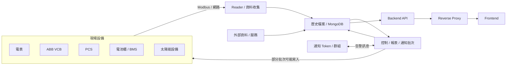
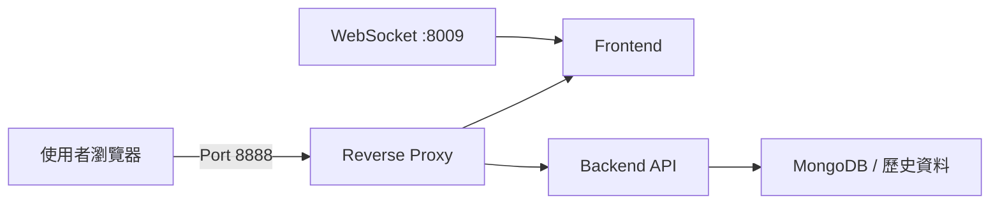

# 全興 EMS 系統整體架構

建立日期：2026/08/15（← 0815 新增）

## 一、整體資料流

## 二、各層責任

| 層級 | 主要功能 | 常見確認方式 |
|---|---|---|
| 現場設備 | 提供電表、VCB、PCS、BMS、太陽能等即時資料 | 設備燈號、Modbus Poll、現場顯示值 |
| Reader | 依點位讀取設備資料 | Reader Log、讀取時間、通訊錯誤 |
| MongoDB／歷史檔案 | 保存即時資料、案件、報表與執行結果 | Collection、時間戳、資料筆數 |
| 批次 | 狀態控制、保護、充放電、報表、備轉、通知 | 批次 Log、輸出 Collection、設備實際反應 |
| Backend API | 將資料庫內容整理成前端需要的格式 | API 狀態碼與回傳 JSON |
| Reverse Proxy | 提供對外入口並轉送前後端請求 | Nginx／Proxy access log |
| Frontend | 顯示即時狀態、設備、報表、告警及投標資料 | 頁面內容、瀏覽器 Network、Console |

## 三、部署關係

- Frontend、Backend API、Reverse Proxy、WebSocket 以 Docker 方式部署。
- 同一個 Compose 會自動建立共用網路；拆成不同 Compose 時，需加入相同 external network。
- 對外請求先進 Reverse Proxy，再轉送到前端或後端。

## 四、重要邊界

- Reader 負責「讀資料」，批次負責「計算、寫資料或控制設備」，API 負責「提供畫面資料」。
- 不是每支批次都有專屬前端頁面；有些只更新資料庫、發通知或控制設備。
- 畫面異常需逐層確認，不可只依批次是否成功判斷。

相關文件：

- [批次、API 與畫面對照](./BATCH_API_UI_MAPPING.md)
- [問題排查流程](./TROUBLESHOOTING_GUIDE.md)
- [完整批次程式盤點](./EMS_BATCH_OVERVIEW.md)
